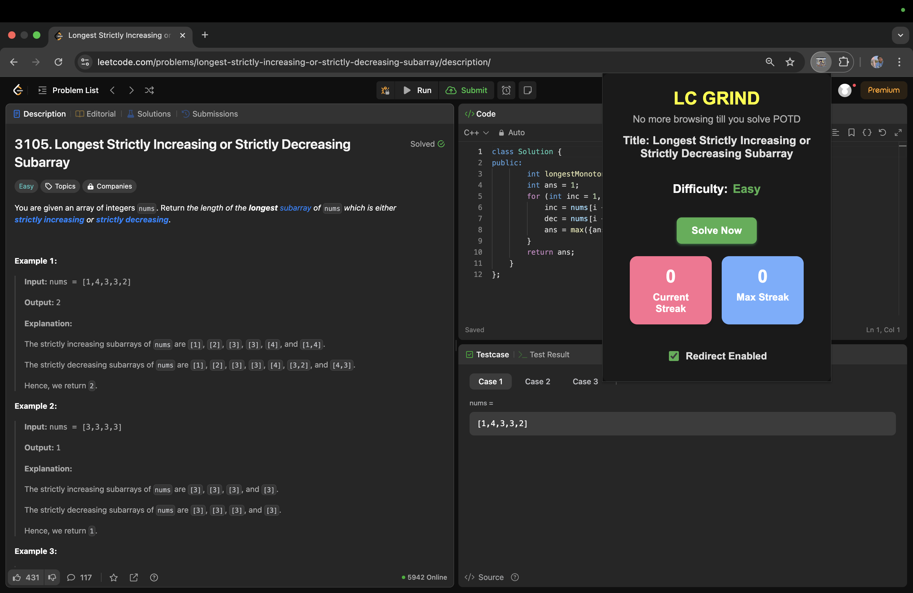

# LC-Grind: Where All Tabs Lead to LeetCode  

A meme Chrome extension that forces you to solve LeetCode's Problem of the Day (POTD) before you can browse anything else. Procrastination? Not an option.  

## What is LC-Grind?  
LC-Grind transforms your browser into a LeetCode shrine—every single URL you visit redirects to LeetCode's POTD. No social media, no distractions, no excuses. Just focused problem-solving.  

## Features  
- Redirects **all** tabs to LeetCode's POTD (even when you "just need to check one thing").  
- No escape until you solve the problem.  
- Tracks your streak to keep you accountable.  

## Screenshots  

### User Interface  
  

### When you try to visit any website (Failure)  
  

### After solving the problem (Success)  
  

## Permissions  
This extension **only** redirects URLs to keep you focused. No data collection, no background tracking—just a simple tool to keep you coding.  

## Who is this for?  
- Programmers who tend to procrastinate.  
- Anyone preparing for coding interviews.  
- People who even procrastinate on procrastination.  

## Installation  
1. Clone this repository or download the ZIP.  
2. Open **chrome://extensions/** in your browser.  
3. Enable **Developer Mode** (top right corner).  
4. Click **Load unpacked** and select the extension folder.  
5. Done. Now get back to solving problems.  

## Contributing  
If you have ideas to make this even more absurdly effective, feel free to open a pull request.  

